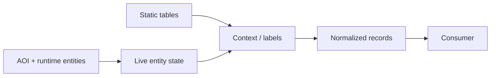

# Aniimo Runtime Research

Client-side runtime research for **Aniimo**.

This repository documents what I learned while investigating how Aniimo represents its live world, entities, owned Aniimo and local game state. It is a research write-up, not a released radar.

There is no radar UI here. There are no binaries, offsets, patch bytes, activation instructions, protection bypasses, live query recipes or copy-paste implementation. The useful part of the work is the model: what exists, where it appears to live, which assumptions were wrong, and how to tell static game data apart from actual per-instance runtime state.

That distinction matters more than it sounds. A species database can tell you what an Aniimo *can* look like. A live entity can tell you what is actually standing in front of the player. Confusing the two produces a beautifully formatted lie.

## Research snapshot

This repository describes findings made against the **September 2026 global client**.

The client can change at any time. Names, layouts and behavior documented here should be treated as a dated research snapshot, not an API contract.

## What I found

At a high level, Aniimo has a client-side model rich enough to describe much more than the ordinary UI exposes at once.

The investigation established that:

- the ordinary Unity `Player.log` is useful for correlation and behavior, but not a complete source for live Aniimo state;
- the small `_client_info_bin.zst` cache I tested was frontend/client state rather than a hidden roster or appraisal database;
- static client data exposes the vocabulary for individual values, properties, scene entities and spawners, but static data must not be mistaken for a live spawn;
- live world Aniimo are represented through runtime entity objects, including `ClientPuppet` instances;
- the runtime exposes enough identity and spatial information to distinguish wild entities and follow their position;
- an AOI/entity layer tracks objects entering and leaving the locally relevant world;
- owned Aniimo records expose individual Potential values separately from species baselines;
- personality information is represented separately from fields such as `nature` and the current character selection;
- a dormant local command interface exists in the client, but its activation and use are intentionally not documented here.

The short architectural version is:

```text
static game data                 live game runtime
      │                                │
      │                           AOI / entity layer
      │                                │
      └──────────── context ────────────┤
                                       │
                               normalized model
                                       │
                                  consumer/UI
```

The consumer is the boring part. The difficult part was deciding which data was real, live and instance-specific.

## Repository layout

- [`docs/architecture.md`](docs/architecture.md) — the runtime model and data flow
- [`docs/entity-model.md`](docs/entity-model.md) — live entities, AOI, Potential and personality data
- [`docs/research-notes.md`](docs/research-notes.md) — the path from useless logs to useful runtime state
- [`docs/data-boundaries.md`](docs/data-boundaries.md) — evidence labels, publication boundary and intentionally omitted implementation details

## The first bad assumption: logs would be enough

The investigation started with the least invasive possibility: perhaps Aniimo already wrote the interesting state somewhere convenient.

It did not.

`Player.log` was useful for understanding events and correlating actions, but it never became a reliable structured source for the data I wanted. Catching and appraising Aniimo did not suddenly produce a clean Potential/personality payload in the obvious client files either.

I also tested the client cache at:

```text
%USERPROFILE%\AppData\LocalLow\Aniimo\Aniimo\client_cache\...\_client_info_bin.zst
```

In the test that mattered, the file remained **3814 bytes and unchanged after a party swap**. That was enough to kill the appealing theory that it contained the live roster or useful per-Aniimo stats.

A few catches changed opaque record flags elsewhere, but not the information required for a trustworthy per-instance model.

So the easy route died. Very considerate of it to do so early.

## Static data is not runtime data

Static client data was still extremely useful, just not in the way I first wanted.

It revealed terminology and structure around:

- individual/IV-style property handling;
- `PetInfo`;
- `basePropertyList`;
- `propertyScoreStage`;
- `nature`;
- scene entity definitions;
- scene spawner definitions;
- runtime object and manager names.

This is enough to understand what the client expects to exist.

It is **not** enough to prove that a particular wild Aniimo currently has a particular individual roll.

That became a rule for the rest of the project: every interesting value needs provenance. If a number comes from a species template, it stays labeled as a species/template value. If it comes from a live object, it can be considered for per-instance state. If the source is ambiguous, the correct output is “unknown,” not a guess wearing a nice UI.

## Live world entities

The useful pivot was the live entity layer.

Wild Aniimo appear as runtime `ClientPuppet` objects with fields/methods that can describe identity and world state. Observed names include:

- `isWild`
- `templateId`
- `level`
- `staticId`
- born/world position data
- `getPosition()`

Other runtime state exists around the object as well, including properties exposed through the entity/property system.

The surrounding AOI/entity system exposes concepts such as:

- entities in local range;
- entity join events;
- entity leave events;
- add/remove entity operations;
- an `ActorManager`-style layer.

That changes the problem completely. Instead of asking “what Aniimo can spawn here?”, the runtime can answer the more interesting question: “what entities does the client currently know about?”

The exact operational path used to turn that into a live external feed is intentionally not included in this repository.

## Owned Aniimo: Potential is real per-individual data

Owned Aniimo records made the difference between template values and true individual values particularly clear.

Within an owned Aniimo record, the individual Potential values are represented through `basePropertyList[*].indLv`.

The observed stat order is:

| Index | Stat |
| ---: | --- |
| 0 | HP |
| 1 | ATK |
| 2 | P.DEF |
| 3 | REGEN |
| 4 | M.DEF |
| 5 | BREAK |

Those values are not the same thing as a species baseline. They belong to the individual record.

A sanitized representation looks like this:

```json
{
  "potential": {
    "hp": "<individual value>",
    "atk": "<individual value>",
    "pdef": "<individual value>",
    "regen": "<individual value>",
    "mdef": "<individual value>",
    "break": "<individual value>"
  }
}
```

The example is deliberately not an extraction recipe. It only documents the resulting model.

## Personality is not `nature`

Another easy trap was assuming an attractively named field must be the thing the UI calls personality.

It was not.

The personality letters are represented through talent identifiers:

| Talent ID | Letter |
| ---: | :---: |
| 201 | E |
| 202 | I |
| 203 | S |
| 204 | N |
| 205 | T |
| 206 | F |
| 207 | J |
| 208 | P |

`nature` is a different concept. `characterInfo.curCharacter` is also a different concept.

This sounds obvious after the fact. Most reverse-engineering mistakes do.

## Species defaults vs. per-spawn rolls

This became the most important validation rule in the project.

A live Aniimo object may expose or reference multiple layers of data at once:

1. species/template information;
2. static spawn configuration;
3. replicated/runtime properties;
4. individual values;
5. UI/appraisal state.

A property merely existing somewhere below an entity does not prove that it is a unique roll for that spawn.

For the research tooling I used internally, candidate values kept their source path and were rejected when they could not be distinguished from species/static data. A failed lookup stayed a failed lookup. I did not promote a plausible default into an individual stat just because the dashboard wanted a number.

That is why the public documentation focuses so heavily on provenance. The hard problem was never drawing dots on a map.

## AOI is the interesting boundary

The Area-of-Interest layer is where the conceptual radar problem becomes much cleaner.

Scene data can describe possible objects and spawn definitions. The AOI/runtime layer describes the entities currently relevant to the client. Join/leave behavior also provides a natural lifecycle for a read-only normalized model:



Nothing about the diagram requires a radar. The same model could support debugging, research, visualization or telemetry experiments.

The actual live bridge and consumer used during my investigation are not part of this repository.

## A dormant local interface exists

One of the stranger findings is that the client contains a local command/socket mechanism with JSON-shaped request handling.

In normal startup behavior it is not exposed as a ready-made public interface.

I confirmed enough of it to establish that the mechanism is real. That is where this repository deliberately stops.

I am **not** publishing:

- the client modification used during testing;
- patch locations, bytes or signatures;
- activation steps;
- port/protocol details;
- framing details;
- request recipes;
- offsets or addresses;
- code that turns the interface into a live Aniimo feed.

Documenting that the mechanism exists is useful research. Publishing a ten-minute recipe for converting it into a cheat is a different project, and not one I am putting here.

## Evidence labels

The documentation uses four labels when the distinction matters:

**Confirmed** — reproduced directly and consistently enough that I am comfortable treating it as established for the researched client build.

**Observed** — seen directly, but with less repetition or a narrower test case than “confirmed.”

**Inferred** — the surrounding behavior strongly suggests an interpretation, but I do not have enough direct evidence to promote it.

**Unknown** — I do not know, or the available data does not distinguish competing explanations.

“Unknown” is allowed to remain unknown. It is much cheaper than debugging a confident fiction later.

## What this repository intentionally does not contain

This is the public line I chose for the project.

Included:

- architecture;
- object/model names that explain the client structure;
- sanitized schemas;
- research chronology;
- static vs. runtime distinctions;
- observed Potential/personality representation;
- AOI/entity concepts;
- failed approaches and validation rules.

Not included:

- a working radar;
- the private UI/dashboard;
- a compiled extractor;
- injection or hooking code;
- client patch bytes/signatures;
- exact activation instructions for dormant interfaces;
- exact offsets/addresses;
- live query recipes;
- protection or anti-cheat bypass instructions;
- automation intended to provide a gameplay advantage.

The omission is deliberate, not an unfinished TODO list.

## Fair-play / terms note

Aniimo's current official material is unusually explicit about third-party tools and client modification.

As of this research snapshot:

- the [Aniimo Fair Play Announcement](https://www.aniimo.com/newslist/detail/100067) prohibits third-party tools and client modifications that interfere with fair play;
- Pawprint's [Terms of Use](https://pawprintstudio.com/terms-of-use/en) include restrictions covering reverse engineering, probing/security circumvention and data mining.

This repository therefore documents architecture and findings without shipping the operational implementation used during research.

Nothing here is an authorization from Pawprint Studio, and the client/rules can change after the date of this snapshot.

## Why publish any of it?

Because the interesting part is not the finished overlay.

The interesting part is the chain of reasoning:

- proving the obvious log/cache paths were insufficient;
- finding the vocabulary for Aniimo individuality in static client data;
- identifying the live entity layer;
- separating world identity from spawn configuration;
- separating species defaults from individual Potential;
- identifying the personality representation instead of trusting misleading field names;
- treating missing provenance as missing data rather than inventing certainty.

That is useful reverse-engineering methodology even if every Aniimo-specific name disappears tomorrow.

## Status

The repository is a **research snapshot**, not a maintained compatibility promise.

If later client versions materially change the model, I may document the difference. I will not publish updates whose only purpose is restoring a broken gameplay-assistance implementation.

## License

There is intentionally **no software/content license** attached to this repository.

The repository being public makes it readable; it does not place the material in the public domain or grant a blanket right to redistribute, repackage or sell it. Ask first if you want to reuse substantial parts of the documentation.

---

Aniimo and its related names/assets belong to their respective rights holders. This is independent technical research and is not affiliated with Pawprint Studio.
