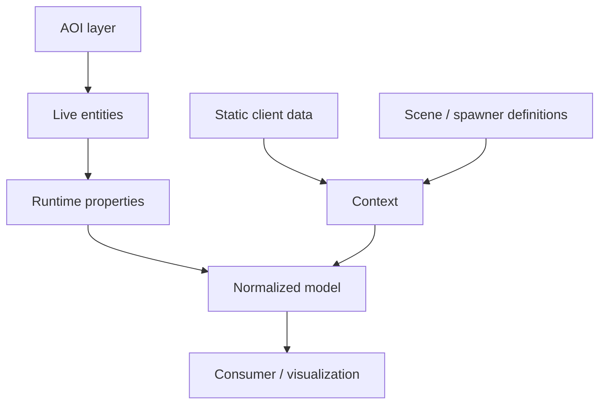

# Runtime architecture

This document describes the model I ended up with after the easier explanations stopped surviving contact with the client.

The important boundary is not “inside the game” versus “outside the game.” It is **static possibility** versus **live instance state**.

## The model



The boxes mean different things:

### Static client data

Static data explains vocabulary, species definitions, property structures and configuration.

It is useful for answering questions such as:

- what is this template ID likely to represent?;
- which fields are meaningful?;
- what property categories exist?;
- what scene/spawner structures does the client know about?

It cannot, by itself, prove the individual state of a live spawn.

### Scene / spawner definitions

The client contains static structures associated with scene entities and spawners, including names such as `scene_entity_data` and `scene_spawner_data` in the researched material.

Those are useful context. They describe configured world content, not a guaranteed list of what the client is presently tracking.

### AOI layer

The AOI/entity system is the conceptual boundary for live world state.

The researched client exposes entity-management concepts including local-range collections and join/leave behavior. Observed names include families such as:

- `entitiesInRange*`
- `onEntityJoin`
- `onEntityLeave`
- `addEntity`
- `removeEntity`
- `ActorManager`

The exact call path is intentionally omitted.

What matters architecturally is the lifecycle:

```text
entity becomes relevant
        ↓
entity exists in local runtime state
        ↓
entity properties/position can change
        ↓
entity leaves local relevance
```

A normalized read-only consumer can mirror that lifecycle without pretending the static scene database is the live world.

### Live entities

Wild Aniimo are represented by runtime objects including `ClientPuppet` instances.

The object provides identity/state concepts such as:

```text
isWild
templateId
level
staticId
born/world position
getPosition()
```

These names are useful because they establish what kind of object is being observed. They are not, by themselves, proof that every property hanging off the object is a unique individual roll.

### Runtime properties

The entity/property system can expose deeper state than the small set of obvious identity fields.

This is where provenance becomes essential.

A runtime object can reference static definitions while also carrying replicated or individual state. A good inspector therefore records not just a value, but **where the value came from**.

Internally I treated a candidate roughly like this:

```json
{
  "field": "<semantic name>",
  "value": "<observed value>",
  "source": "<runtime source path>",
  "confidence": "confirmed | observed | inferred | unknown"
}
```

That is a documentation schema, not an extraction API.

## Normalization

The normalized layer exists to stop implementation details leaking into every consumer.

A conceptual live-world record can be as small as:

```json
{
  "kind": "wild_aniimo",
  "identity": {
    "template": "<template identity>",
    "runtime": "<runtime identity>"
  },
  "level": "<level>",
  "position": {
    "x": 0,
    "y": 0,
    "z": 0
  }
}
```

An owned Aniimo record can separately carry individual data:

```json
{
  "kind": "owned_aniimo",
  "potential": {
    "hp": "<value>",
    "atk": "<value>",
    "pdef": "<value>",
    "regen": "<value>",
    "mdef": "<value>",
    "break": "<value>"
  },
  "personality": "<four letters>"
}
```

The public repository stops at this model.

## Why I did not use the consumer as the source of truth

A dashboard is extremely good at hiding bad assumptions.

Once a label, icon and number are rendered together, the result *looks* authoritative. That visual confidence is dangerous when the underlying value was only a plausible template default.

The model therefore follows three rules:

1. source state before presentation state;
2. per-instance claims require per-instance provenance;
3. missing data remains missing.

The UI is downstream. It does not get to promote an inference into a fact.

## Static IDs, template IDs and runtime identity

The client exposes multiple identity concepts because they solve different problems.

A template/species identity is useful for understanding *what* an entity is.

A static scene identity can be useful for understanding configured world placement/content.

A runtime identity is useful for understanding *which current object instance* is being tracked.

Those identities should not be collapsed just because a consumer wants one convenient key.

## Position

The live object exposes world-position concepts, including born/origin coordinates and a current-position getter.

That distinction matters for moving objects. Spawn/origin position and current position are not necessarily interchangeable.

A consumer interested in live location should prefer live position state. Static spawn coordinates remain useful context, especially when validating that an entity belongs to an expected region/spawner.

## The dormant local interface

The client also contains a local command/socket mechanism with JSON-shaped command handling.

The research established that this mechanism is real and distinct from ordinary log/cache files.

Normal startup does not present it as a ready-made public API.

I am intentionally not documenting:

- how it was activated during research;
- the local endpoint details;
- framing/protocol details;
- client changes used to expose it;
- commands/requests used to inspect runtime state.

The architecture does not depend on publishing those details. The useful conclusion is simply that the client contains an internal local command path capable of interacting with runtime state.

## What changed once the architecture was clear

Before the runtime/AOI model, the project was mostly searching for a convenient hidden file.

Afterward, the problem became much cleaner:

```text
not: “where did the game save this?”

but: “which live object owns this state, and is the value actually individual?”
```

That was the real turning point.
